  

<h2>Hey there! 👋</h2>

I'm Jordan, a second year Computer Science student at the University of Ottawa who's current main focus is front end web development. I am constantly learning and practicing my skills by creating applications that are responsive, fast, and practical.

I am currently open for an internship or jon opportunity, here is my <a href="https://github.com/jordan-na/jordan-na">resume</a>

Want to know more about me ? Check out my <a href="https://github.com/jordan-na/jordan-na">portfolio</a>

<h2>Connect With Me 🔗</h2>

&nbsp;&nbsp;&nbsp;&nbsp;&nbsp;&nbsp;&nbsp;&nbsp;

<h2>📌 Pinned Repositories</h2>

  
  &nbsp;
  &nbsp;
  

  
  &nbsp;
  &nbsp;
  

  
  &nbsp;
  &nbsp;
  

<h2>📈 GitHub Stats</h2>

  
  &nbsp;
  &nbsp;
  

<h2>Skills </h2>

